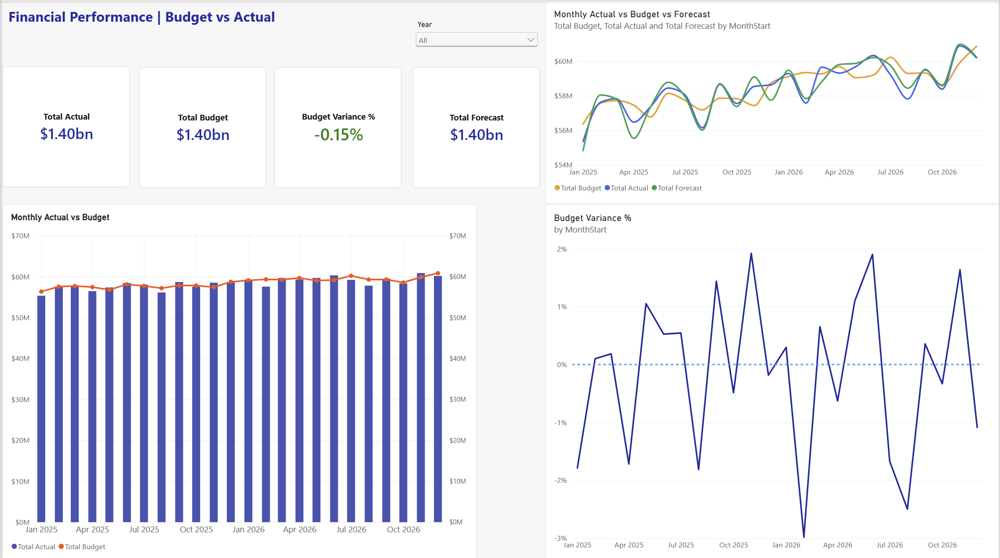
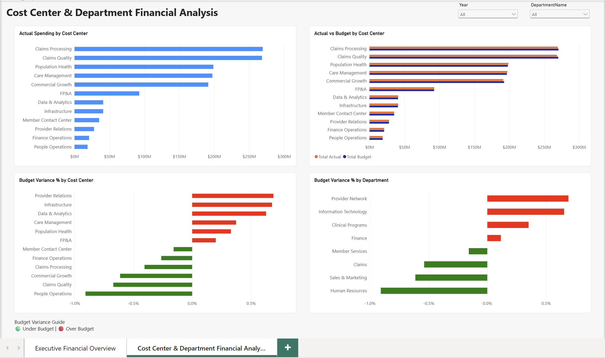
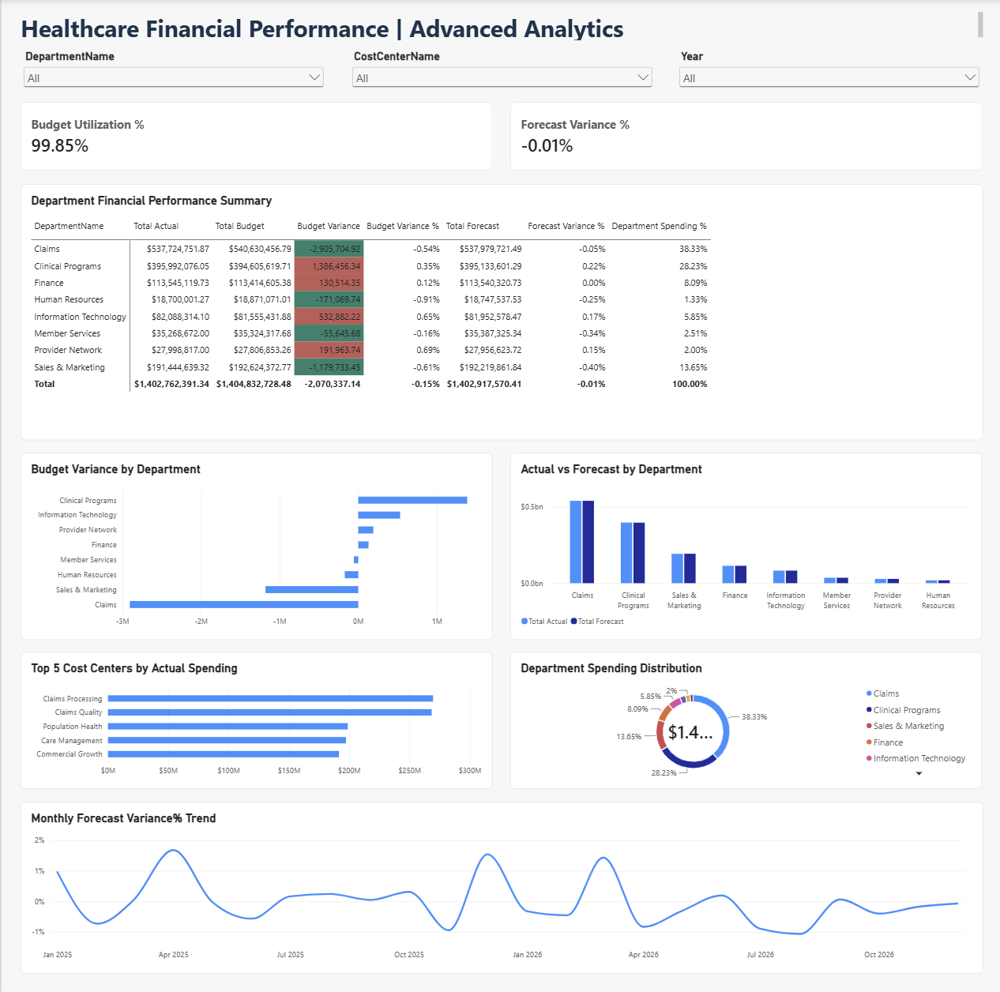

<div align="center">

# 🏥 Healthcare Financial BI Analytics

### From Financial Data to Executive-Ready Decisions

**An Independent Power BI Portfolio Case Study | 100% Synthetic Healthcare Data**

<br>


<br>

**FINANCIAL PERFORMANCE &nbsp; • &nbsp; BUDGET CONTROL &nbsp; • &nbsp; FORECAST ACCURACY**

<br>

<table>
<tr>
<td align="center" width="33%">
<strong>01</strong><br>
EXECUTIVE OVERVIEW<br>
<sub>Actuals · Budget · Forecast</sub>
</td>
<td align="center" width="33%">
<strong>02</strong><br>
COST CENTER ANALYSIS<br>
<sub>Spending · Variance · Departments</sub>
</td>
<td align="center" width="33%">
<strong>03</strong><br>
ADVANCED ANALYTICS<br>
<sub>Utilization · Forecast Variance</sub>
</td>
</tr>
</table>

<br>

[**Executive Overview**](#executive-financial-overview) &nbsp; • &nbsp;
[**Financial Analysis**](#cost-center--department-financial-analysis) &nbsp; • &nbsp;
[**Technical Documentation**](TECHNICAL_DOCUMENTATION.md)

</div>

---

## ✨ At a Glance

Healthcare finance teams need a consistent view of spending, budgets, forecasts, and cost-center performance. This project brings those perspectives into a three-page Power BI report designed to help decision-makers spot variances, compare departments, and explore monthly trends.

| Project dimension | Delivery |
|:--|:--|
| **Domain** | Healthcare financial planning and performance |
| **Report** | 3 interactive Power BI pages |
| **Core analysis** | Actual vs. budget, actual vs. forecast, cost centers, departments, monthly trends |
| **Technical approach** | Dimensional model, DAX measures, Power Query, SQL reference scripts |
| **Quality evidence** | Financial reconciliation workbook and validation CSVs |
| **Data classification** | Synthetic; no real patient or employer records |

## 📈 Financial Performance Snapshot

*Illustrative results from the synthetic dataset with report filters cleared. Rounded values are for presentation.*

| KPI | Result | Interpretation |
|:--|--:|:--|
| **Total actual** | **$1.403B** | Recorded financial activity |
| **Total budget** | **$1.405B** | Planned amount |
| **Budget variance** | **−$2.07M** | Actual minus budget |
| **Budget variance %** | **−0.15%** | Spending below budget overall |
| **Budget utilization** | **99.85%** | Actual as a share of budget |
| **Total forecast** | **~$1.40B** | Forecast baseline, rounded |

> **Sign convention:** `Actual − Budget`. Positive values indicate **over-budget** spending; negative values indicate **under-budget** spending. This interpretation applies to the expense-oriented comparisons in this report.

The report's **Forecast Variance %** measure compares actual spending with the forecast and responds to department, cost-center, and year filters. The figures above represent the unfiltered report; results change when users interact with slicers.

---

## 🖥️ Dashboard Gallery

### 01 · Executive Financial Overview



**Purpose:** Provide an executive summary of actuals, budgets, forecasts, and monthly financial performance.

- KPI cards for actual, budget, forecast, and budget variance %
- Monthly actual-versus-budget comparison
- Monthly actual, budget, and forecast trends
- Budget variance percentage over time
- Year filtering for focused review

### 02 · Cost Center & Department Financial Analysis



**Purpose:** Identify where spending and budget deviations are concentrated.

- Actual spending ranked by cost center
- Actual versus budget by cost center
- Budget variance % by cost center and department
- Red/green variance indicators with an explanatory legend
- Department, cost-center, and year slicers

### 03 · Advanced Financial Analysis



**Purpose:** Explore financial efficiency, departmental performance, and forecast behavior.

- Budget utilization % and forecast variance % KPI cards
- Department financial performance matrix with conditional formatting
- Budget variance by department
- Actual versus forecast by department
- Top cost centers by actual spending
- Department spending distribution
- Monthly forecast variance trend

---

## 🎯 Business Questions Answered

1. Are overall expenses running above or below budget?
2. Which departments and cost centers contribute the largest budget variances?
3. How closely do actuals track forecasts across reporting periods?
4. Which cost centers account for the most spending?
5. How does the financial picture change when a specific department, cost center, or year is selected?

## 🧱 Data Model & Architecture

The Power BI model uses financial fact tables and shared reporting dimensions to support reusable measures and consistent filtering.

**Fact tables**

| Table | Role |
|:--|:--|
| `FactFinancials` | Actual financial amounts |
| `FactBudget` | Budget amounts |
| `FactForecast` | Forecast amounts |
| `FactHeadcount` | Headcount-related source data; not a featured metric in the final report |

**Dimension tables**

`DimDate` · `DimDepartment` · `DimCostCenter` · `DimAccount` · `DimExpenseCategory`

```text
Synthetic financial source data
             │
             ▼
   Power Query preparation
             │
             ▼
Power BI dimensional data model
  ├─ Financial fact tables
  └─ Shared reporting dimensions
             │
             ▼
       Reusable DAX KPIs
             │
             ▼
 Three-page interactive report
             │
             ▼
 Reconciliation and review
```

> The diagram is a conceptual workflow, not an assertion of specific table relationships or cardinalities. Refer to the PBIX model view to inspect the implemented relationships.

## 🧮 DAX Highlights

The report uses reusable measures so KPI cards, charts, and matrices respond consistently to filter context.

```dax
Total Actual =
SUM(FactFinancials[ActualAmount])

Total Budget =
SUM(FactBudget[BudgetAmount])

Total Forecast =
SUM(FactForecast[ForecastAmount])

Budget Variance =
[Total Actual] - [Total Budget]

Budget Variance % =
DIVIDE([Budget Variance], [Total Budget])

Budget Utilization % =
DIVIDE([Total Actual], [Total Budget], 0)

Forecast Variance % =
DIVIDE([Total Actual] - [Total Forecast], [Total Forecast], 0)
```

**Technical note:** Percentage measures use `DIVIDE` for safe denominator handling. The explicit `0` fallback shown above is used for the two advanced KPI measures. For additional measures and commentary, see the existing DAX reference files under [`dax/`](dax/).

## ✅ Validation & Quality Controls

Financial reporting requires more than attractive visuals. This project includes reconciliation artifacts to support confidence in the displayed amounts.

| Check | Evidence / status |
|:--|:--|
| Actual and budget aggregate reconciliation | **PASS** in the completed financial reconciliation worksheet |
| Report-wide actual | **$1,402,762,391.34** |
| Report-wide budget | **$1,404,832,728.48** |
| Calculated budget variance | **−$2,070,337.14** |
| Budget variance rate | **−0.15%**, rounded |
| Filter interactions | Tested in Power BI Desktop |
| Additional source-to-report controls | Supporting CSV and workbook files retained with the project |

**Validation artifacts:** `monthly-financial-reconciliation.csv`, `monthly-budget-actual-validation.csv`, and corresponding workbook files are available in the local project materials. Include them in the repository if you want reviewers to reproduce the checks.

*Validation status refers to the checks performed for this portfolio project; it is not a claim of a formal external audit.*

## 🛠️ Tools & Skills Demonstrated

| Area | Tools and methods |
|:--|:--|
| **Business intelligence** | Power BI Desktop, interactive report design, slicers, KPI cards, matrices |
| **Analytical logic** | DAX, filter context, budget and forecast variance calculations |
| **Data preparation** | Power Query, synthetic Excel data |
| **Data architecture** | Fact/dimension modeling, reusable measures |
| **Supporting technical artifacts** | SQL scripts and DAX measure documentation |
| **Quality assurance** | Reconciliation, aggregate comparisons, visual interaction testing |
| **Business analysis** | Healthcare finance, departmental cost management, budget monitoring |

**Scope note:** Microsoft Fabric, Azure, Databricks, and Python are not claimed as implemented components of this finished Power BI report. They may be explored in separate projects.

## 📂 Repository Contents

```text
healthcare-financial-bi-analytics/
├── README.md
├── Healthcare_Financial_BI_Analytics.pbix
├── healthcare-financial-bi-synthetic-data.xlsx
├── executive-financial-overview.png
├── cost-center-department-financial-analysis.png
├── advanced-financial-analysis.png         # Add with final upload
├── data/
│   └── raw/
├── dax/
├── sql/
└── documentation/
```

The repository tree above reflects the **intended final upload state**; the advanced dashboard image and any validation artifacts not yet uploaded should be added before publishing this revision.

## 📚 Technical Reference

- **Power BI report:** [`Healthcare_Financial_BI_Analytics.pbix`](Healthcare_Financial_BI_Analytics.pbix)
- **Synthetic source workbook:** [`healthcare-financial-bi-synthetic-data.xlsx`](healthcare-financial-bi-synthetic-data.xlsx)
- **DAX documentation:** [`dax/`](dax/)
- **SQL reference files:** [`sql/`](sql/)
- **Supporting documentation:** [`documentation/`](documentation/)

### How to Explore

1. Download the PBIX and synthetic workbook from this repository.
2. Open the PBIX in **Power BI Desktop**.
3. If the data source path differs from your local machine, update the workbook path in Power Query and refresh.
4. Explore the three report pages and test the year, department, and cost-center slicers.
5. Review the DAX definitions and reconciliation evidence alongside the report.

## 🔒 Data Privacy & Project Scope

This is an **independent portfolio project** using **synthetic healthcare financial data**. It is not a deployment for a real healthcare organization and does not contain confidential employer information, patient records, or personally identifiable information.

The report demonstrates financial BI design and validation practices; it does not represent an audited financial statement or a production-certified data platform.

---

<div align="center">

### Built to turn financial complexity into clear, actionable insight.

**Power BI · DAX · Healthcare Financial Analytics · Data Validation**

[⬆ Back to top](#-healthcare-financial-bi-analytics)

</div>
